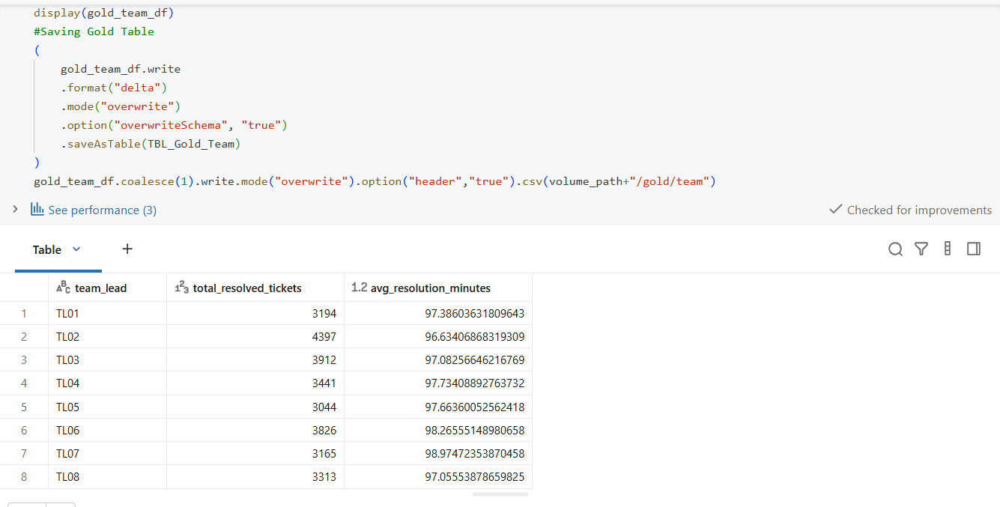
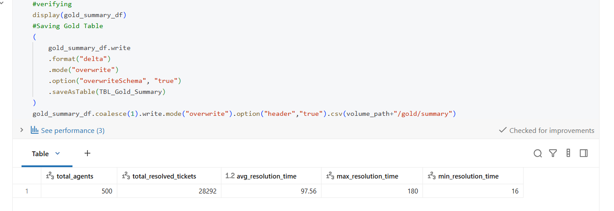
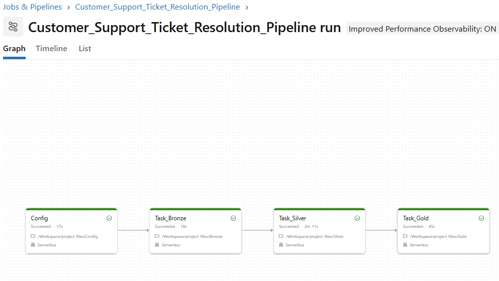

# Customer Support Ticket Resolution Pipeline

A Databricks/PySpark pipeline that ingests raw customer support ticket logs, cleans and validates them, applies business rules (resolution quality threshold, team scope filter, Day-2 carry-over), and produces Gold-layer KPIs for leadership reporting.

Built using the **Medallion Architecture** (Bronze → Silver → Gold) on Databricks, orchestrated as a multi-notebook Databricks Job for one-click, repeatable execution.

---

## Table of Contents

- [Business Problem](#business-problem)
- [Architecture](#architecture)
- [Repository Structure](#repository-structure)
- [Business Rules](#business-rules)
- [Notebooks](#notebooks)
- [Data](#data)
- [How to Use](#how-to-use)
- [Databricks Job](#databricks-job)
- [Documentation](#documentation)

---

## Business Problem

Leadership ran a two-day Customer Support Efficiency Review and needed a clean, structured dataset to answer four questions that raw CSV exports couldn't answer directly:

1. Ticket resolution rates across the team hierarchy (Team Leads TL01–TL08)
2. Per-agent performance broken out by Day 1 and Day 2
3. Compliance with a resolution quality threshold (>15 minutes to count as a genuine resolution)
4. Identification of agents who carried over unresolved work from Day 1 into Day 2

The raw data couldn't answer these because it was split across two files, contained invalid/out-of-scope records, stored resolution time as text (e.g. `"0h 22m 45s"`), and had no link between a ticket and the agent's team hierarchy.

## Architecture

```
Raw CSVs (Unity Catalog Volume)
        │
        ▼
  [Bronze] ── reads raw CSVs, writes as-is Delta tables
        │
        ▼
  [Silver] ── joins agent profiles, applies scope filter,
              converts resolution time, applies quality
              threshold, applies Day-2 carry-over rule
        │
        ▼
  [Gold]  ── aggregates KPIs: team performance, agent
              performance, category performance, summary
```

## Repository Structure

```
Customer-Support-Ticket-Resolution-Pipeline/
├── README.md
├── notebooks/
│   ├── Config.ipynb
│   ├── Bronze.ipynb
│   ├── Silver.ipynb
│   └── Gold.ipynb
├── Data/
│   ├── raw/
│   │   ├── profiles.csv
│   │   ├── day1.csv
│   │   └── day2.csv
│   └── processed/
│       ├── silver_day1.csv
│       ├── silver_day2.csv
│       ├── gold_team_performance.csv
│       ├── gold_agent_performance.csv
│       ├── gold_category_performance.csv
│       └── gold_summary.csv
├── Docs/
│   └── Customer_Support_Pipeline_Documentation.docx
└── Jobs/
    └── job_config.yaml
```

## Business Rules

| Rule | Definition |
|---|---|
| Successful Resolution | Status = "Resolved" **AND** resolution time > 15 minutes |
| Resolution Time Format | Text format `Xh Xm Xs`, converted to total decimal minutes |
| Rounding Rule | Seconds ≥ 30 round up to the next full minute; otherwise dropped |
| Day 2 Carry-over Rule | Agents who succeeded on Day 1 are excluded from Day 2 results |
| Scope Filter | Only agents reporting to Team Leads TL01–TL08 are included |

## Sample Outputs

**Gold Layer — Team Performance**
Ticket volume and average resolution time per Team Lead (TL01–TL08).



**Gold Layer — Summary**
Overall pipeline statistics across all 500 agents.



**Databricks Job — Successful End-to-End Run**
Config → Bronze → Silver → Gold, all tasks completed successfully.



## Notebooks

| Notebook | Purpose |
|---|---|
| `Config` | Shared constants — database name, table names, volume path, common imports. Run via `%run "./Config"` at the top of each of the other notebooks. |
| `Bronze` | Reads `profiles.csv`, `day1.csv`, `day2.csv` from a Unity Catalog Volume and writes them as raw Delta tables (`bronze_profiles`, `bronze_day1`, `bronze_day2`). |
| `Silver` | Joins tickets to agent profiles, applies the TL01–TL08 scope filter, converts resolution time to minutes, applies the >15-minute quality threshold, and applies the Day-2 carry-over rule. Writes `silver_day1`, `silver_day2`. |
| `Gold` | Aggregates KPIs into `gold_team_performance`, `gold_agent_performance`, `gold_category_performance`, and `gold_summary`. |

## Data

`Data/raw/` contains the three source files, with intentional edge cases to validate the pipeline's robustness:

- Blank/missing `ticket_id`, `agent_id`, or `resolution_time` values
- Malformed resolution times (e.g. `"BADTIME"`)
- Out-of-scope agents (reporting to a Team Lead outside TL01–TL08)
- Agents who succeed on Day 1 and reappear on Day 2 (to validate the carry-over filter)
- Rushed tickets closed in ≤15 minutes (to validate the quality threshold)

`Data/processed/` contains exported CSV snapshots of the Silver and Gold outputs, so results can be reviewed without running the pipeline.

## How to Use

These are Databricks notebooks exported in **`.ipynb`** format. They were authored for Databricks and use `dbutils` and a live Spark session — they render on GitHub for viewing, but running them requires a Databricks workspace (not plain Jupyter).

### Import Instructions
1. Log into a Databricks workspace (Databricks Free Edition works fine — no Azure/AWS account needed).
2. Left sidebar → **Workspace** → navigate to the folder you want.
3. Right-click → **Import** → upload each `.ipynb` file (or drag-and-drop).
4. Import all four: `Config.ipynb`, `Bronze.ipynb`, `Silver.ipynb`, `Gold.ipynb`, into the **same folder** — `Bronze`, `Silver`, and `Gold` reference `Config` via `%run "./Config"`, which is a relative path.

### Running the Pipeline
1. In your workspace, go to **Catalog** → create a Volume (e.g. `project.schema_project.volume_project`).
2. Upload `Data/raw/profiles.csv`, `day1.csv`, `day2.csv` into that Volume.
3. Open `Config.ipynb` and update `volume_path` to match your Volume's path.
4. Run `Bronze` → then `Silver` → then `Gold`, in that order — or use the Databricks Job below for one-click execution.

### Requirements
- Databricks workspace with Unity Catalog enabled (Free Edition is sufficient)
- No external cloud credentials required — uses Unity Catalog Volumes for file storage
  
## Databricks Job

`Jobs/job_config.json` contains the exported Job definition: four sequential tasks
(`Config → Bronze → Silver → Gold`), so the whole pipeline runs end-to-end with a
single **Run now** click.

To recreate it in your own workspace:
1. **Jobs & Pipelines** → **Create Job**.
2. Click the **⋮** menu → **Edit as JSON**.
3. Paste in the contents of `job_config.json`, adjusting the `notebook_path` values to match where you imported the notebooks in your workspace.

## Documentation

`Docs/Customer_Support_Pipeline_Documentation.docx` contains the full project write-up: business problem, architecture, implementation details for each layer (with code snippets), environment setup, orchestration, and data validation approach.
